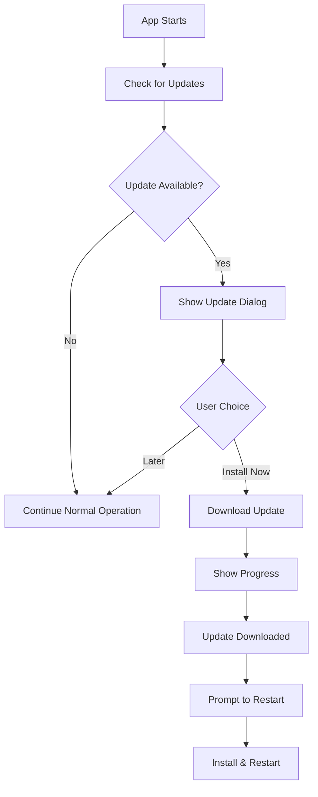

# AlphaHunters Auto-Update System & GitHub Repository Setup

## Overview

This document outlines the complete setup for AlphaHunters' GitHub repository, version management, and automatic update system. The system will allow users to automatically receive updates when new versions are published.

## Table of Contents

1. [GitHub Repository Setup](#github-repository-setup)
2. [Auto-Update System Architecture](#auto-update-system-architecture)
3. [Implementation Guide](#implementation-guide)
4. [Release Workflow](#release-workflow)
5. [Security Considerations](#security-considerations)

## GitHub Repository Setup

### 1. Initial Repository Creation

```bash
# Navigate to project directory
cd C:\Users\jrember\Desktop\Scripts\AlphaHunter

# Initialize git repository
git init

# Create .gitignore file
# (See section below for contents)

# Add all files
git add .

# Create initial commit
git commit -m "Initial commit - AlphaHunters v0.1.0"

# Create repository on GitHub
gh repo create AlphaHunters --public --description "Educational letter tracing adventure game"

# Push to GitHub
git push -u origin main

# Create initial release
gh release create v0.1.0 --title "AlphaHunters v0.1.0" --notes "Initial release"
```

### 2. Repository Structure

```
AlphaHunters/
├── .github/
│   └── workflows/
│       └── release.yml      # GitHub Actions for automated releases
├── audio/                   # Game audio assets
├── js/                      # Game source code
├── styles/                  # CSS styles
├── server/                  # Multiplayer server
├── .gitignore
├── package.json
├── electron-main.js
├── index.html
├── README.md
├── LICENSE
├── CHANGELOG.md
└── auto-updater.js         # Auto-update implementation
```

### 3. .gitignore File

```gitignore
# Dependencies
node_modules/
server/node_modules/

# Build outputs
dist/
build/
*.log

# OS files
.DS_Store
Thumbs.db

# IDE files
.vscode/
.idea/

# Environment files
.env
.env.local

# Sensitive data
teacher.json

# Temporary files
*.tmp
*.temp

# Electron
electron-builder.yml
```

### 4. Updated package.json

```json
{
  "name": "alphahunters",
  "version": "0.1.0",
  "description": "AlphaHunters - Educational Letter Tracing Adventure Game",
  "main": "electron-main.js",
  "author": "jremberbsd46",
  "license": "MIT",
  "repository": {
    "type": "git",
    "url": "https://github.com/jremberbsd46/AlphaHunters.git"
  },
  "scripts": {
    "start": "electron .",
    "start-dev": "NODE_ENV=development electron .",
    "start-server": "cd server && npm start",
    "install-all": "npm install && cd server && npm install",
    "build": "electron-builder",
    "build-win": "electron-builder --win",
    "build-mac": "electron-builder --mac",
    "build-linux": "electron-builder --linux",
    "release": "electron-builder --publish always"
  },
  "devDependencies": {
    "electron": "^27.0.0",
    "electron-builder": "^24.6.4"
  },
  "dependencies": {
    "electron-updater": "^6.1.7"
  },
  "build": {
    "appId": "com.alphahunters.game",
    "productName": "AlphaHunters",
    "directories": {
      "output": "dist"
    },
    "files": [
      "**/*",
      "!dist",
      "!.git",
      "!.gitignore",
      "!*.md",
      "!test-*.html"
    ],
    "publish": {
      "provider": "github",
      "owner": "jremberbsd46",
      "repo": "AlphaHunters",
      "releaseType": "release"
    },
    "win": {
      "target": "nsis",
      "icon": "assets/icon.ico",
      "publisherName": "AlphaHunters Team"
    },
    "mac": {
      "target": "dmg",
      "icon": "assets/icon.icns",
      "category": "public.app-category.education"
    },
    "linux": {
      "target": "AppImage",
      "icon": "assets/icon.png",
      "category": "Education"
    },
    "nsis": {
      "oneClick": false,
      "allowToChangeInstallationDirectory": true,
      "createDesktopShortcut": true,
      "createStartMenuShortcut": true
    }
  }
}
```

## Auto-Update System Architecture

### 1. How It Works



### 2. Update Flow

1. **On Application Start**
   - Check GitHub releases for newer version
   - Compare with current version

2. **Update Detection**
   - If newer version exists, show notification
   - Allow user to choose when to update

3. **Download Process**
   - Show progress bar during download
   - Download in background if user chooses

4. **Installation**
   - Prompt user to restart when ready
   - Install update and restart application

## Implementation Guide

### 1. Install Required Package

```bash
npm install electron-updater --save
```

### 2. Create auto-updater.js

```javascript
const { autoUpdater } = require('electron-updater');
const { dialog, BrowserWindow } = require('electron');

class AppUpdater {
    constructor(mainWindow) {
        this.mainWindow = mainWindow;
        
        // Configure auto-updater
        autoUpdater.autoDownload = false;
        autoUpdater.autoInstallOnAppQuit = true;
        
        // Set up event handlers
        this.setupEventHandlers();
        
        // Check for updates
        this.checkForUpdates();
    }
    
    setupEventHandlers() {
        // Update available
        autoUpdater.on('update-available', (info) => {
            dialog.showMessageBox(this.mainWindow, {
                type: 'info',
                title: 'Update Available',
                message: `A new version (${info.version}) is available!`,
                detail: 'Would you like to download and install it now?',
                buttons: ['Install Now', 'Later'],
                defaultId: 0,
                cancelId: 1
            }).then((result) => {
                if (result.response === 0) {
                    autoUpdater.downloadUpdate();
                    this.showDownloadProgress();
                }
            });
        });
        
        // No update available
        autoUpdater.on('update-not-available', () => {
            console.log('App is up to date');
        });
        
        // Download progress
        autoUpdater.on('download-progress', (progressObj) => {
            let message = `Download speed: ${this.formatBytes(progressObj.bytesPerSecond)}/s`;
            message += ` - Downloaded ${progressObj.percent.toFixed(2)}%`;
            message += ` (${this.formatBytes(progressObj.transferred)} / ${this.formatBytes(progressObj.total)})`;
            
            console.log(message);
            
            // Send progress to renderer
            this.mainWindow.webContents.send('download-progress', progressObj);
        });
        
        // Update downloaded
        autoUpdater.on('update-downloaded', () => {
            dialog.showMessageBox(this.mainWindow, {
                type: 'info',
                title: 'Update Ready',
                message: 'Update downloaded successfully!',
                detail: 'The application will restart to apply the update.',
                buttons: ['Restart Now', 'Later'],
                defaultId: 0,
                cancelId: 1
            }).then((result) => {
                if (result.response === 0) {
                    autoUpdater.quitAndInstall();
                }
            });
        });
        
        // Error handling
        autoUpdater.on('error', (error) => {
            dialog.showErrorBox('Update Error', 
                `An error occurred while updating: ${error.message}`);
        });
    }
    
    checkForUpdates() {
        // Check for updates on startup
        autoUpdater.checkForUpdatesAndNotify();
        
        // Check every 4 hours
        setInterval(() => {
            autoUpdater.checkForUpdatesAndNotify();
        }, 4 * 60 * 60 * 1000);
    }
    
    showDownloadProgress() {
        // Create progress window
        const progressWindow = new BrowserWindow({
            width: 400,
            height: 200,
            parent: this.mainWindow,
            modal: true,
            show: false,
            webPreferences: {
                nodeIntegration: true,
                contextIsolation: false
            }
        });
        
        progressWindow.loadURL(`data:text/html,
            <html>
            <head>
                <style>
                    body {
                        font-family: Arial, sans-serif;
                        padding: 20px;
                        background: #f0f0f0;
                    }
                    h2 { margin-top: 0; }
                    .progress-bar {
                        width: 100%;
                        height: 30px;
                        background: #ddd;
                        border-radius: 5px;
                        overflow: hidden;
                    }
                    .progress-fill {
                        height: 100%;
                        background: #4CAF50;
                        transition: width 0.3s;
                        width: 0%;
                    }
                    .info { margin-top: 10px; color: #666; }
                </style>
            </head>
            <body>
                <h2>Downloading Update...</h2>
                <div class="progress-bar">
                    <div class="progress-fill" id="progress"></div>
                </div>
                <div class="info" id="info">Starting download...</div>
                <script>
                    const { ipcRenderer } = require('electron');
                    ipcRenderer.on('download-progress', (event, progress) => {
                        document.getElementById('progress').style.width = progress.percent + '%';
                        document.getElementById('info').innerText = 
                            'Downloaded ' + progress.percent.toFixed(2) + '%';
                    });
                </script>
            </body>
            </html>
        `);
        
        progressWindow.once('ready-to-show', () => {
            progressWindow.show();
        });
        
        // Close progress window when download is complete
        autoUpdater.once('update-downloaded', () => {
            progressWindow.close();
        });
    }
    
    formatBytes(bytes) {
        if (bytes === 0) return '0 Bytes';
        const k = 1024;
        const sizes = ['Bytes', 'KB', 'MB', 'GB'];
        const i = Math.floor(Math.log(bytes) / Math.log(k));
        return parseFloat((bytes / Math.pow(k, i)).toFixed(2)) + ' ' + sizes[i];
    }
}

module.exports = AppUpdater;
```

### 3. Update electron-main.js

Add auto-updater initialization:

```javascript
const { app, BrowserWindow } = require('electron');
const path = require('path');
const AppUpdater = require('./auto-updater');

let mainWindow;
let appUpdater;

function createWindow() {
    mainWindow = new BrowserWindow({
        width: 1200,
        height: 800,
        webPreferences: {
            nodeIntegration: true,
            contextIsolation: false
        },
        icon: path.join(__dirname, 'assets/icon.png')
    });

    mainWindow.loadFile('index.html');
    
    // Initialize auto-updater in production only
    if (app.isPackaged) {
        appUpdater = new AppUpdater(mainWindow);
    }
}

app.whenReady().then(createWindow);
```

### 4. In-Game Update Notification

Add to Game.js or create update-notifier.js:

```javascript
class UpdateNotifier {
    constructor(game) {
        this.game = game;
        this.setupIPC();
    }
    
    setupIPC() {
        if (window.require) {
            const { ipcRenderer } = window.require('electron');
            
            // Listen for update notifications
            ipcRenderer.on('update-available', (event, version) => {
                this.showUpdateNotification(version);
            });
            
            // Listen for download progress
            ipcRenderer.on('download-progress', (event, progress) => {
                this.updateDownloadProgress(progress);
            });
        }
    }
    
    showUpdateNotification(version) {
        const notification = document.createElement('div');
        notification.className = 'update-notification';
        notification.style.cssText = `
            position: fixed;
            top: 20px;
            right: 20px;
            background: #4CAF50;
            color: white;
            padding: 15px 20px;
            border-radius: 10px;
            box-shadow: 0 4px 8px rgba(0,0,0,0.3);
            z-index: 10000;
            font-family: Arial, sans-serif;
            animation: slideIn 0.3s ease-out;
        `;
        
        notification.innerHTML = `
            <div style="display: flex; align-items: center; gap: 10px;">
                <span style="font-size: 24px;">🎉</span>
                <div>
                    <strong>Update Available!</strong><br>
                    <small>Version ${version} is ready to install</small>
                </div>
            </div>
        `;
        
        document.body.appendChild(notification);
        
        // Auto-hide after 10 seconds
        setTimeout(() => {
            notification.style.animation = 'slideOut 0.3s ease-out';
            setTimeout(() => notification.remove(), 300);
        }, 10000);
    }
}
```

## Release Workflow

### 1. Version Numbering

Follow Semantic Versioning (SemVer):
- **MAJOR.MINOR.PATCH** (e.g., 0.1.0)
- **MAJOR**: Breaking changes
- **MINOR**: New features (backward compatible)
- **PATCH**: Bug fixes

### 2. Creating a New Release

```bash
# 1. Update version in package.json
# Change "version": "0.1.0" to "version": "0.2.0"

# 2. Update CHANGELOG.md
# Add release notes for the new version

# 3. Commit changes
git add .
git commit -m "Release v0.2.0"

# 4. Create git tag
git tag v0.2.0

# 5. Push to GitHub
git push origin main --tags

# 6. Build the application
npm run build

# 7. Create GitHub release with binaries
gh release create v0.2.0 \
  --title "AlphaHunters v0.2.0" \
  --notes-file CHANGELOG.md \
  dist/AlphaHunters-Setup-0.2.0.exe \
  dist/AlphaHunters-0.2.0.dmg \
  dist/AlphaHunters-0.2.0.AppImage
```

### 3. Automated Release with GitHub Actions

Create `.github/workflows/release.yml`:

```yaml
name: Build and Release

on:
  push:
    tags:
      - 'v*'

jobs:
  release:
    runs-on: ${{ matrix.os }}
    
    strategy:
      matrix:
        os: [windows-latest, macos-latest, ubuntu-latest]
    
    steps:
      - uses: actions/checkout@v3
      
      - name: Setup Node.js
        uses: actions/setup-node@v3
        with:
          node-version: '18'
      
      - name: Install dependencies
        run: npm install
      
      - name: Build and Release
        env:
          GH_TOKEN: ${{ secrets.GITHUB_TOKEN }}
        run: npm run release
```

### 4. CHANGELOG.md Template

```markdown
# Changelog

All notable changes to AlphaHunters will be documented in this file.

## [0.2.0] - 2024-01-20

### Added
- Automatic update system
- Classroom monitoring for teachers
- New letter templates

### Changed
- Improved multiplayer performance
- Updated UI scaling system

### Fixed
- Contest panel z-index issue
- Bot score decimal display

## [0.1.0] - 2024-01-15

### Added
- Initial release
- Core gameplay mechanics
- Multiplayer support
- Teacher dashboard
- Character progression system
```

## Security Considerations

### 1. Code Signing

For production releases, code signing is recommended:

**Windows**: 
```json
"win": {
  "certificateFile": "./certs/certificate.pfx",
  "certificatePassword": "${CERTIFICATE_PASSWORD}"
}
```

**macOS**:
```json
"mac": {
  "identity": "Developer ID Application: Your Name",
  "hardenedRuntime": true,
  "notarize": {
    "teamId": "YOUR_TEAM_ID"
  }
}
```

### 2. Update Security

- Updates are served over HTTPS from GitHub
- electron-updater verifies signatures automatically
- Only signed releases will be installed

### 3. Environment Variables

Never commit sensitive data. Use environment variables:

```bash
# .env (do not commit)
GH_TOKEN=your_github_token
CERTIFICATE_PASSWORD=your_cert_password
```

## Testing Updates

### 1. Local Testing

```javascript
// In development, force update check
if (process.env.NODE_ENV === 'development') {
    autoUpdater.forceDevUpdateConfig = true;
    autoUpdater.updateConfigPath = path.join(__dirname, 'dev-app-update.yml');
}
```

### 2. dev-app-update.yml

```yaml
provider: generic
url: http://localhost:8080/
updaterCacheDirName: alphahunters-updater-dev
```

### 3. Test Scenarios

1. **New Version Available**
   - Increment version
   - Build and serve locally
   - Test update flow

2. **Download Interruption**
   - Start download
   - Disconnect network
   - Verify error handling

3. **Installation**
   - Complete download
   - Test restart flow
   - Verify new version

## Troubleshooting

### Common Issues

1. **"Cannot find module 'electron-updater'"**
   - Run `npm install electron-updater --save`

2. **Updates not detected**
   - Ensure version in package.json is lower than release
   - Check GitHub release is published (not draft)
   - Verify internet connection

3. **Certificate errors on macOS**
   - Need to notarize the app for macOS Catalina+
   - Use Apple Developer certificate

4. **Silent failures**
   - Check electron logs: `%APPDATA%/alphahunters/logs`
   - Enable debug mode: `autoUpdater.logger = console`

## Next Steps

1. **Set up GitHub repository**
2. **Implement auto-updater.js**
3. **Test update system locally**
4. **Create first release (v0.1.0)**
5. **Test auto-update with v0.1.1**
6. **Set up GitHub Actions for automated builds**
7. **Consider code signing for production**

This system will ensure users always have the latest version of AlphaHunters with minimal friction while maintaining security and stability.